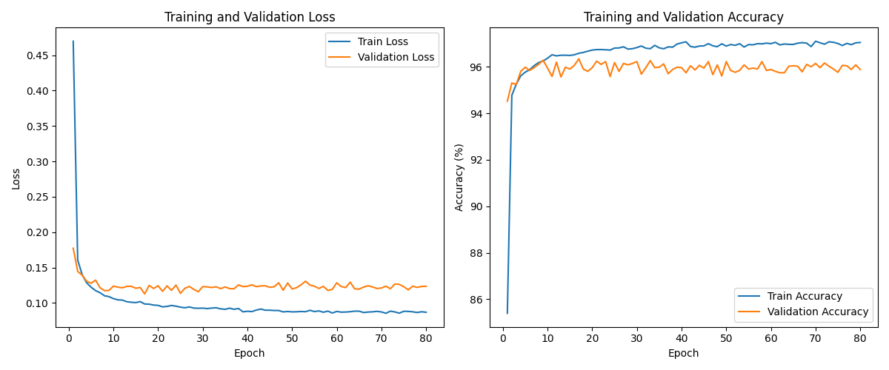

# Image Classification on CIFAR-10: Comparing CNNs and Vision Transformers

## Overview
This repository contains the final project for COMS 573. It presents a comparative analysis of three neural network architectures for image classification on the CIFAR-10 dataset. We explore the performance trade-offs between a baseline Convolutional Neural Network (CNN), a DenseNet, and a pre-trained Vision Transformer (ViT).

Our key achievement was fine-tuning the state-of-the-art DINOv2-Small model using a parameter-efficient approach, where we updated only 8.06% of its total parameters to achieve an impressive 95.95% test accuracy.

## Team Members
- **Md Muzakker Hossain:** DINO-v2 pre-trained ViT + fine-tune with LoRA + Evaluation
- **Nhat Le:** custom CNN model + Architectures + Evaluation
- **Jasper Khor:** Data Preprocessing

## Key Findings & Results
Our experiments show a clear progression in performance. It highlights the power of modern architectures and transfer learning.

| Model | Test Accuracy (%) | Test Loss | Total Parameters | Fine-Tuned Params (%) |
| :--- | :---: | :---: | :---: | :---: |
| **Shallow CNN** | 83.46% | 0.5299 | ~4.8M | 100% |
| **DenseNet** | 91.22% | 0.3692 | ~7.4M | 100% |
| **DINOv2-Small (ViT)** | **95.95%** | **0.1243** | 22.06M | **8.06%** |

### Insights:
* **Transformer Superiority**: The pre-trained DINOv2 Vision Transformer significantly outperformed both CNN architectures. It demonstrates the effectiveness of self-attention mechanisms for capturing global image features.
* **Power of Transfer Learning**: DINOv2's strong performance, achieved by fine-tuning just a fraction of its weights, proves that knowledge from large-scale, self-supervised pre-training is highly transferable, even to smaller datasets like CIFAR-10.
* **Rapid Convergence**: Due to its robust pre-trained features, the DINOv2 model converged extremely quickly and achieved over 95% validation accuracy within the first 10 epochs of training.
* **Architectural Value**: The DenseNet model's architecture, with its emphasis on feature reuse, provided a substantial accuracy boost over the baseline CNN, making it a strong intermediate choice.

*The training and validation curves for our fine-tuned DINOv2 model, showing rapid convergence and stable performance.*

## Repository Structure
This repository is organized to provide a complete overview of our project methodology and findings.
* `COMS_573_Final_Project.pdf`: The complete project report containing detailed methodology, analysis, and conclusions.
* `notebooks/`: Jupyter/Colab notebooks used for implementing, training, and evaluating the models.
* `images/`: Contains diagrams and plots used in the report and this README.
* `dataset/`: Information regarding the CIFAR-10 dataset used for this project.

## Dataset & Preprocessing
We used the **CIFAR-10 dataset**, a standard benchmark for image classification.
* Classes**: 10 (airplane, automobile, bird, cat, deer, dog, frog, horse, ship, truck)
* Image Size**: 32x32 RGB color images 
* Split**: The original 50,000 training images were split into 45,000 for training and 5,000 for validation. The 10,000 test images were used for final evaluation.

### Preprocessing Steps:
For the training set, we applied data augmentation to improve model generalization:
* Random 32x32 cropping with a padding of 4 
* Random horizontal flipping 
* Random rotation (up to 15 degrees) 
* Normalization (mean: `[0.4914, 0.4822, 0.4465]`, std: `[0.247, 0.243, 0.261]`) 
* The validation and test sets were only normalized.

## Models & Configurations
### 1. Shallow CNN (Baseline)
A simple, lightweight CNN to establish a performance baseline.
* **Architecture**: 3 convolutional blocks (Conv -> Batch Norm -> ReLU -> MaxPool) followed by 2 fully connected layers.
* **Filters**: Progressively increased from 32 to 64 to 128.
* **Regularization**: Dropout layer to prevent overfitting.
* **Optimizer**: AdamW with a learning rate of `0.001`.

### 2. DenseNet
A custom implementation inspired by the original paper, designed to enhance feature reuse.
* **Architecture**: 3 dense blocks, each with 16 layers.
* **Growth Rate**: 12
* **Bottleneck Layers**: Used to reduce dimensionality and improve efficiency.
* **Regularization**: Dropout (`rate=0.1`) within each dense block.
* **Optimizer**: AdamW (learning rate `0.001`, weight decay `0.0001`).
* **Epochs**: 50 

### 3. DINOv2-Small Vision Transformer (ViT)
A pre-trained transformer model adapted for CIFAR-10 using a parameter-efficient fine-tuning strategy.
* **Base Model**: `dinov2_vits14` from Facebook Research.
* **Architecture**: 12 transformer blocks, 6 attention heads, and an embedding dimension of 384.
* **Fine-Tuning Strategy (PEFT)**:
    * Froze all layers except the final classification head and the last transformer block.
    * Implemented **Low-Rank Adaptation (LoRA)** with a rank of 16 to efficiently adapt attention layers.
    * This resulted in only **1,779,082 trainable parameters (8.06% of total)**.
* **Training Details**:
    * **Input Size**: CIFAR-10 images were resized from 32x32 to 224x224.
    * **Optimizer**: AdamW (learning rate `1e-4`, weight decay `0.01`).
    * **Scheduler**: Cosine annealing learning rate scheduler.
    * **Batching**: Effective batch size of 32 (8 physical batch size with 4 gradient accumulation steps).
    * **Epochs**: 80
    * **Hardware**: Trained on a single NVIDIA Tesla V100 GPU for approx. 2 hours and 9 minutes.

## Technology Stack
* **Framework**: PyTorch
* **Libraries**: Torchvision, NumPy, Matplotlib
* **Fine-Tuning**: Parameter-Efficient Fine-Tuning (PEFT) with LoRA
* **Hardware**: NVIDIA Tesla V100 GPU with CUDA 

## References
* Oquab, M., et al. (2023). *DINOv2: Learning Robust Visual Features without Supervision*.
* Huang, G., et al. (2017). *Densely Connected Convolutional Networks*. 
* Dosovitskiy, A., et al. (2020). *An Image is Worth 16x16 Words: Transformers for Image Recognition at Scale*.
